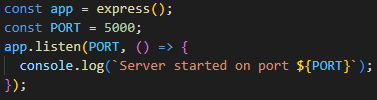
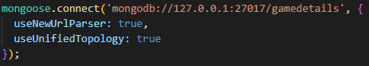
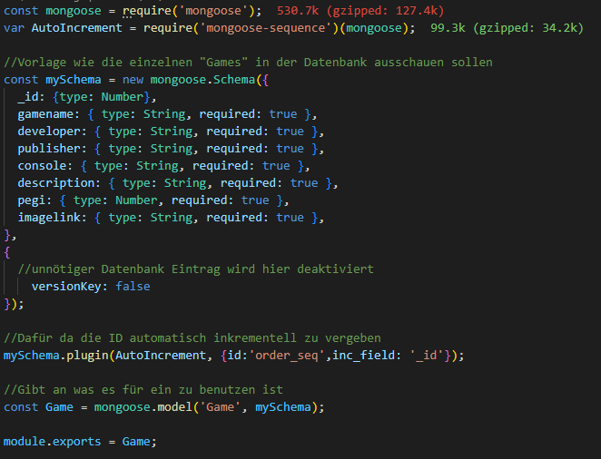
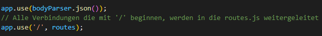
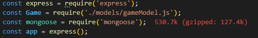
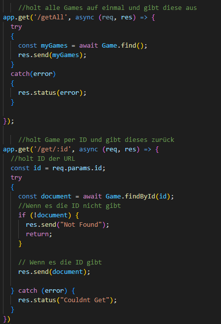
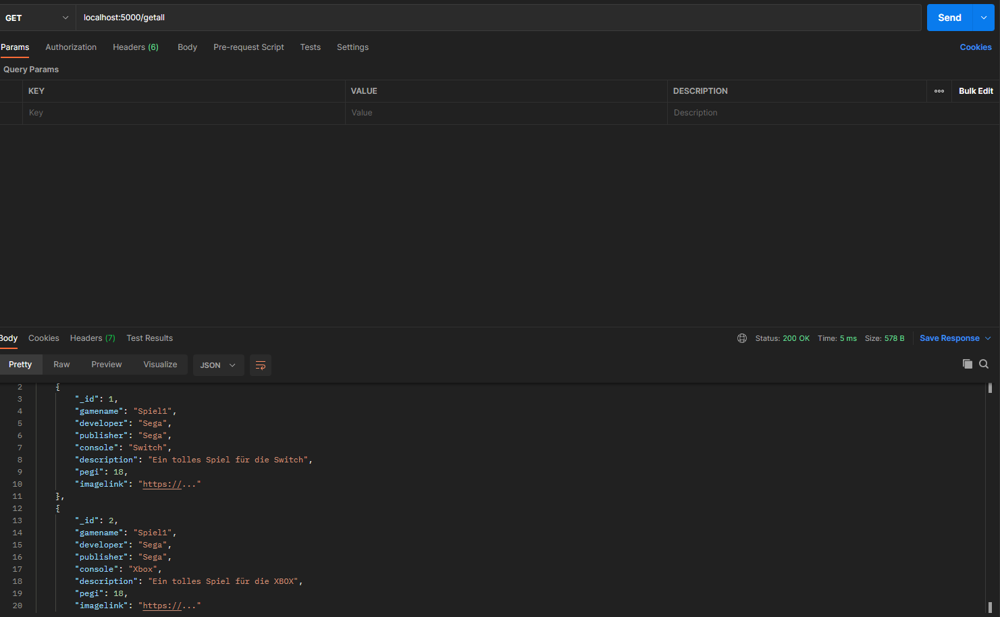
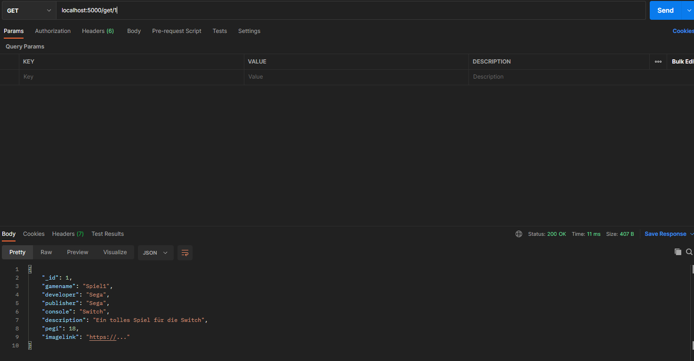

# MyGameList
## Videospiel Datenbank mit Rest-API
## WPF Client um Einträge der Datenbank hinzuzufügen
## Webapplikation um Datenbank Einträge zu einer persönlichen Liste hinzuzufügen und diese für den User zu speichern
---

## API
Die API soll folgende Requests verarbeiten können:
 - Get
 - Post
 - Put
 - Delete

Für meine API habe ich mich für eine Node bzw. JavaScript API entschieden mit den Modulen "express", "mongoose" und "body-parser". Es wird ebenfalls eine weitere Javascript Datei importiert, nämlich "routes.js". In dieser Datei werden die verschiedenen Routen der API festgelegt.

Ich habe mich dafür entschieden, für jeweils GET und DELETE eine Funktion für alle Datensätze zu machen, sprich /deleteAll und /getAll sowie eine Funktion für einzelne Datensätze, sprich /delete/:ID und /get/:ID. 

Folgende Imports sind notwendig:

 

---
## Express
Express ist dafür da, um schnell und einfach einen Webserver aufzusetzen. Im Prinzip muss man nur eine Express Applikation mittels des express() Befehls erzeugen und diese einer Variable zuordnen. Es ist ebenfalls wichtig, der Variable (In meinem Fall "app"), zu sagen, auf welchen Port die Applikation hören muss. Dies geschieht mit der .listen() Funktion. 

In meinem Beispiel läuft der Server auf Port 5000 und es wird ebenfalls in der Konsole ausgegeben, auf welchen Port der Server Läuft.

---

## Mongoose
Mongoose ist das Modul, um mit einer Lokalen MongoDB Datenbank oder einer MongoDB Datenbank im Netz zu kommunizieren. In meinem Fall habe ich eine Lokale MongoDB Datenbank mittels des MongoDB Kompass aufgesetzt, inder meine Daten später gespeichert werden sollen. Mit mongoose.connect() können wir uns mit unserer Lokalen Datenbank Verbinden, in meinem Fall heißt meine DB "gamedetails". Dort werden die generierten Objekte als Documents speichern. Als Addresse wird "mongodb://127.0.0.1:27017/gamedetails" benutzt, gamedetails ist der Name der Datenbank und die Addresse davor zeigt an, dass es eine Datenbank im Localhost ist. 

Es ist notwendig, eine "Model" Datei für die Documents zu erstellen. Sie ist im Prinzip wie eine Klasse zu sehen, da sie vorschreibt, welche Daten benötigt werden um den Datensatz in die DB zu schreiben. Mein Model heißt "gameModel.js" und beinhaltet folgenden Code:

In dieser Datei wird wieder "mongoose" benötigt, aber auch "mongoose-sequence". Mongoose ist dafür da, um das erzeugte Model zu einem richtigen Schema zu machen, und Sequence ist ein extra Tool, um die eindeutige ID der MongoDB mit aufsteigenden Zahlen zu ersetzen. Mit const mySchema = new mongoose.Schema((...)) wird das Schema erstellt. Hierbei kann man beispielsweise den Typen festlegen, ob der Wert sein muss, ob er null sein kann, etc. Es wird ebenfalls der versionKey Wert auf false gesetzt, da es in diesem Fall ein unnötiger Eintrag ist.

Myschema.plugin(...) ist für das vorher genannte Module Sequence. Diese Zeile ersetzt die _id mit einer sequenziellen Reihenfolge. Am Ende wird das Model noch als "Game" gestzt und wird zum Schluss noch mit module.exports exporiert.

---

## Body-Parser
Ist kurzgesagt nur dafür da, um die Daten die bei den Verschiedenen Anfragen im Body stehen zu lesen. Der Body-Parser wird nur einmal aufgerufen, um dem Express Server zu sagen, dass er ihn benutzen soll. Ebenfalls wird dem Server gesagt, dass er die "routes.js" benutzen soll, für alle Routen, die mit '/' beginnen.

---

## Routes.js

Diese Datei ist für die Routen der API verantworklich und kann in die vier verschiedenen Arten der Requests aufgeteilt werden. Folgende Imports werden benötigt:

Für alle Requests gilt das gleiche, alle sind asynchrone Methoden, was bedeutet, dass sie nicht blockierende Funktionen sind. Außerdem haben alle Methoden eine Request Variable und eine dazugehörende Response Variable. Sie werden mit app.[METHODE] aufgerufen, beispielsweise app.get(...), app.post(...), etc.

---
### Get Requests

Im Methoden Aufruf wird am Anfang die Route festgelegt und im Anschluss eine asynchrone Lambda Funktion.

Die Getall Methode versucht sich alle "Game" Objekte aus der Datenbank zu holen und speichert diese in ein Array. Im Anschluss werden alle Games als Response zurückgeschickt. Falls es einen Fehler gibt, wird durch Exception Handling der Fehler gefangen und es wird der Error als Response geschickt.

Die Get/:ID Methode sucht nach der angegebenen ID in der Datenbank und versucht das Spiel mit de gewissen ID zu holen. Falls es dieses Spiel nicht finden kann, wird "Not Found" als Response geschickt. Falls es das Spiel finden kann wird das Spiel als Response geschickt. Falls etwas unerwartet Schief geht, wird durch Exception Handling "Couldnt Get" gesendet.

Test GetAll:

Test GetID:

---
### Post Request

### Put Request

### Delete Requests

### Code:

## Client
...

## Web Applikation
...