# MyGameList
## Videospiel Datenbank mit Rest-API
## WPF Client um Einträge der Datenbank hinzuzufügen
## Webapplikation um Datenbank Einträge zu einer persönlichen Liste hinzuzufügen und diese für den User zu speichern

---
### Aufbau des Projektes veranschaulicht:

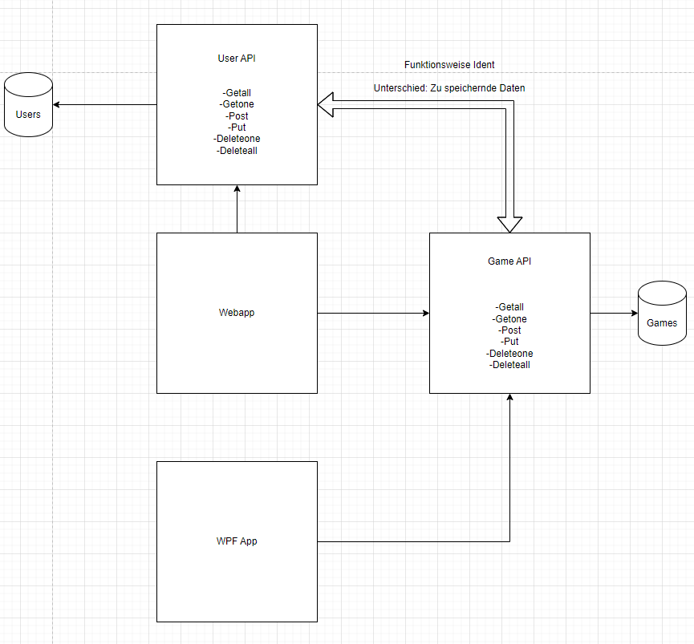 

---

## How to start:

Als erstes wird die .zip Datei entpackt und man erhält folgende Dateien:
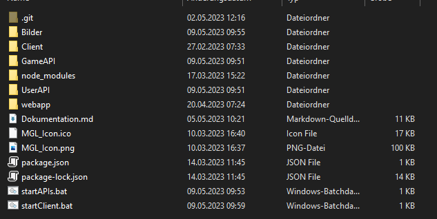 

Um das Projekt zu starten ist es notwendig, die "startAPIs.bat" Datei auszuführen um die benötigten APIs zu starten.

Um den Client zu benutzen muss man die "startClient.bat" Datei ausführen.

Um die Webapp auszuführen ist Visual Studio notwendig. Man geht in den Ordner "webapp" und führt dort die Datei "MyApplication.sln" aus. Damit öffnet man das Mudblazor Projekt und kann es von dort aus starten.

 

Um nun die Webapp zu starten, muss man oben in der Leiste auf "IIS Express" drücken.

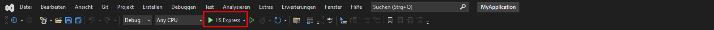 

# Dokumentation
## Game API
Die folgende API ist für die Videospiele und soll folgende Requests verarbeiten können:
 - Get
 - Post
 - Put
 - Delete

Für meine API habe ich mich für eine Node bzw. JavaScript API entschieden mit den Modulen "express", "mongoose" und "body-parser". Es wird ebenfalls eine weitere Javascript Datei importiert, nämlich "routes.js". In dieser Datei werden die verschiedenen Routen der API festgelegt.

Ich habe mich dafür entschieden, für jeweils GET und DELETE eine Funktion für alle Datensätze zu machen, sprich /deleteAll und /getAll sowie eine Funktion für einzelne Datensätze, sprich /delete/:ID und /get/:ID. 

Folgende Imports sind notwendig:

 

---
## Express
Express ist dafür da, um schnell und einfach einen Webserver aufzusetzen. Im Prinzip muss man nur eine Express Applikation mittels des express() Befehls erzeugen und diese einer Variable zuordnen. Es ist ebenfalls wichtig, der Variable (In meinem Fall "app"), zu sagen, auf welchen Port die Applikation hören muss. Dies geschieht mit der .listen() Funktion. 

In meinem Beispiel läuft der Server auf Port 5000 und es wird ebenfalls in der Konsole ausgegeben, auf welchen Port der Server Läuft.

---

## Mongoose
Mongoose ist das Modul, um mit einer Lokalen MongoDB Datenbank oder einer MongoDB Datenbank im Netz zu kommunizieren. In meinem Fall habe ich eine Lokale MongoDB Datenbank mittels des MongoDB Kompass aufgesetzt, inder meine Daten später gespeichert werden sollen. Mit mongoose.connect() können wir uns mit unserer Lokalen Datenbank Verbinden, in meinem Fall heißt meine DB "gamedetails". Dort werden die generierten Objekte als Documents speichern. Als Addresse wird "mongodb://127.0.0.1:27017/gamedetails" benutzt, gamedetails ist der Name der Datenbank und die Addresse davor zeigt an, dass es eine Datenbank im Localhost ist. 

Es ist notwendig, eine "Model" Datei für die Documents zu erstellen. Sie ist im Prinzip wie eine Klasse zu sehen, da sie vorschreibt, welche Daten benötigt werden um den Datensatz in die DB zu schreiben. Mein Model heißt "gameModel.js" und beinhaltet folgenden Code:

In dieser Datei wird wieder "mongoose" benötigt, aber auch "mongoose-sequence". Mongoose ist dafür da, um das erzeugte Model zu einem richtigen Schema zu machen, und Sequence ist ein extra Tool, um die eindeutige ID der MongoDB mit aufsteigenden Zahlen zu ersetzen. Mit const mySchema = new mongoose.Schema((...)) wird das Schema erstellt. Hierbei kann man beispielsweise den Typen festlegen, ob der Wert sein muss, ob er null sein kann, etc. Es wird ebenfalls der versionKey Wert auf false gesetzt, da es in diesem Fall ein unnötiger Eintrag ist.

Myschema.plugin(...) ist für das vorher genannte Module Sequence. Diese Zeile ersetzt die _id mit einer sequenziellen Reihenfolge. Die Aufzählende Zahl, wird in einer Extra Collection namens "counters" gespeichert. Am Ende wird das Model noch als "Game" gestzt und wird zum Schluss noch mit module.exports exporiert.

---

## Body-Parser
Ist kurzgesagt nur dafür da, um die Daten die bei den Verschiedenen Anfragen im Body stehen zu lesen. Der Body-Parser wird nur einmal aufgerufen, um dem Express Server zu sagen, dass er ihn benutzen soll. Ebenfalls wird dem Server gesagt, dass er die "routes.js" benutzen soll, für alle Routen, die mit '/' beginnen.

---

## Routes.js

Diese Datei ist für die Routen der API verantworklich und kann in die vier verschiedenen Arten der Requests aufgeteilt werden. Folgende Imports werden benötigt:

Für alle Requests gilt das gleiche, alle sind asynchrone Methoden, was bedeutet, dass sie nicht blockierende Funktionen sind. Außerdem haben alle Methoden eine Request Variable und eine dazugehörende Response Variable. Sie werden mit app.[METHODE] aufgerufen, beispielsweise app.get(...), app.post(...), etc.

---

### Get Requests

Im Methoden Aufruf von allen Requests wird am Anfang die Route festgelegt und im Anschluss eine asynchrone Lambda Funktion geöffnet. Alle Requests sind ebenfalls in try-catch Blöcken umhüllt, um alle Möglichen Fehler zu fangen und damit einen Absturz der API zu gewährleisten.

Die Getall Methode versucht sich alle "Game" Objekte aus der Datenbank zu holen und speichert diese in ein Array. Im Anschluss werden alle Games als Response zurückgeschickt. Falls es einen Fehler gibt, wird durch Exception Handling der Fehler gefangen und es wird der Error als Response geschickt.

Die Get/:ID Methode sucht nach der angegebenen ID in der Datenbank und versucht das Spiel mit de gewissen ID zu holen. Falls es dieses Spiel nicht finden kann, wird "Not Found" als Response geschickt. Falls es das Spiel finden kann wird das Spiel als Response geschickt. Falls etwas unerwartet Schief geht, wird durch Exception Handling "Couldnt Get" gesendet.

Test GetAll:

Test GetID:

---

### Post Request

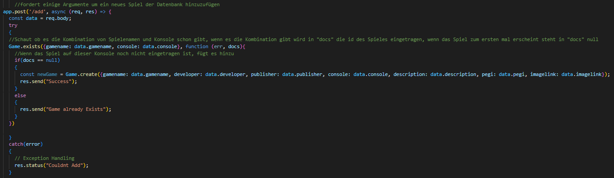

Am Anfang werden die Daten, die verschickt wurden, in der Variable data gespeichert.

Die Speicherung der Daten hat folgenden Grund: Sie werden für eine Abfrage auf potenziell bereits bestehende Spiele benutzt. Mit Game.exists({gamename: data.gamename, console:data.console}) wird überprüft, ob es ein bestimmtes Spiel schon auf einer bestimmten Konsole gibt. Diese Abfrage wurde eingebaut, da sich Spiele auf verschiedenen Konsolen unterscheiden können obwohl sie den selben Namen haben und im Endeffekt dasselbe Spiel sein sollte.

Diese Abfrage prüft im Model "Game" ob es ein Spiel mit genau diesem Namen und dieser Konsole gibt. Falls es das Spiel schon bereits in der Datenbank gibt, wird in der Variable "docs" das Spiel gespeichert und als Response "Game already exists" geschickt.

Wenn "docs" kein Spiel beinhaltet wird mit den Daten in "data" ein neues Spiel erzeugt und direkt in die Datenbank hinzugefügt.

Test Post:

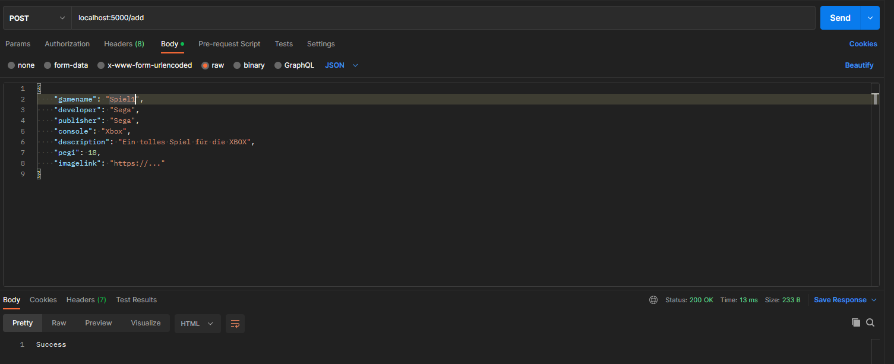

Test Post wenn Spiel bereits in DB:

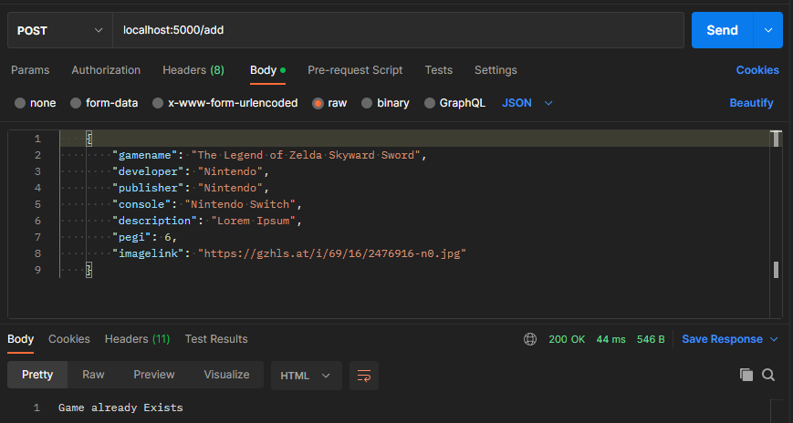

---

### Put Request

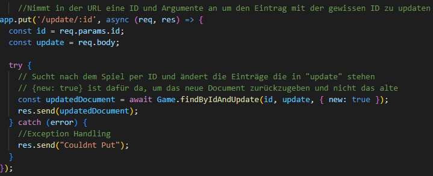

Für Put wird vom Request die ID und das danach gewollte Update gespeichert. In Update kann es sein dass mehrere verschiedene Daten stehen, wie z.B. Gamename und PEGI. Es muss sich aber nicht darum gekümmert werden, da die Methode findByIdAndUpdate damit arbeitet.

Die genannte Funktion fordert eine ID die zum Updaten ist und das zu machende Update. Ebenfalls kann angegeben werden, ob dadurch ein neues Objekt erzeugt werden soll oder nicht. In diesem Fall wird ein neues Objekt erzeugt. und zwischengespeichert. Wenn das Game erfolgreicht überschrieben wurde, wird es als Response zurückgeschickt.

Test Put:

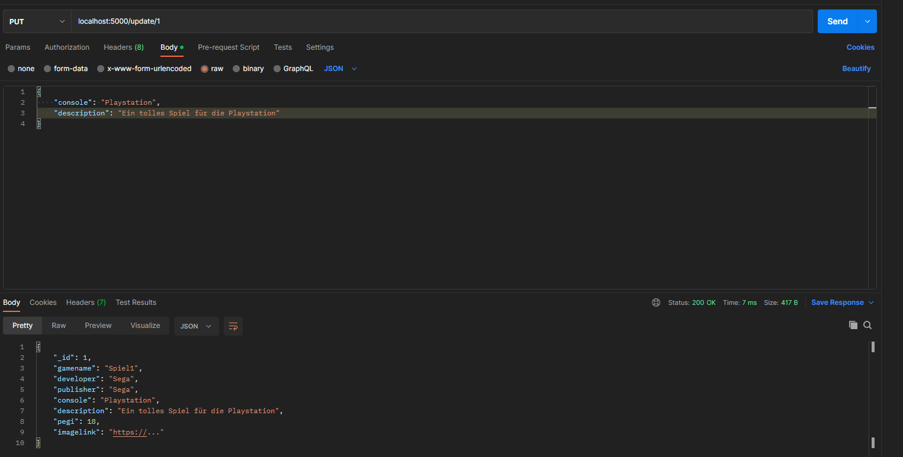

---

### Delete Requests

Delete hat wieder zwei verschiedene Anwendungen: "/delete/:ID" und "/deleteall".

Für "delete/:id" is es notwendig, die ID mitzugben. Sie wird direkt am Anfang in eine Variable gespeichert. Mit ".findByIdAndDelete(id)" wird das Spiel direkt gelöscht und ein boolean zurückgegeben. 

Wenn der boolean false ist wird als Response "Not Found" zurückgegeben. Wenn alles funktioniert hat, wird "Document Deleted" gesendet. 

Bei "/deleteAll" ist es nur notwendig, die Adresse aufzurufen. durch ".deleteMany()" werden direkt alle Spiele gelöscht. Desweiteren ist es für die Zukunft nötig, dass die IDs wieder zurückgesetzt werden, da diese sonst weiterzählen würden. Dafür wird die extra erstellte Collection "counters" gelöscht.

Test DeleteOne:

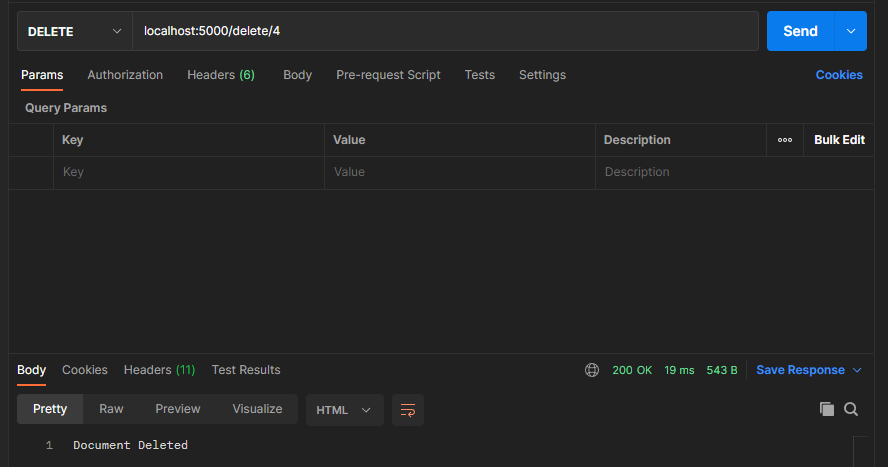

Test DeleteAll:

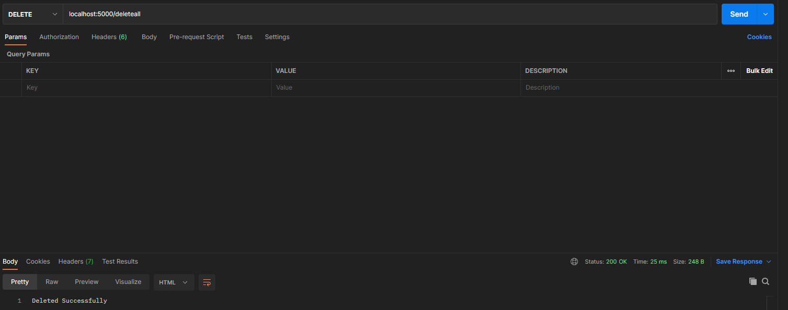

---

### Restlicher Code des Servers :

Desweiteren ist es notwendig sich um die CORS Policy zu kümmern. Diese ist dafür da, dass für Server eingeschränkt wird, wohin sie Daten weiterleiten können. Würde man sich nicht darum kümmern, könnte man keine Requests von den Clients verschicken ohne einen richtigen Fehler in der Entwicklung zu sehen. In diesem Beispiel wurde alles deaktiviert, da es in diesem Fall nicht wichtig ist.

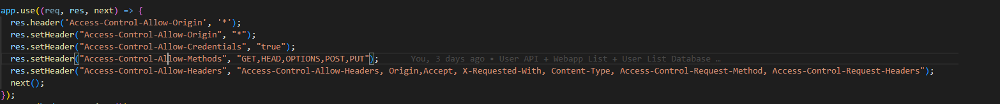

Gesamter Code Server:

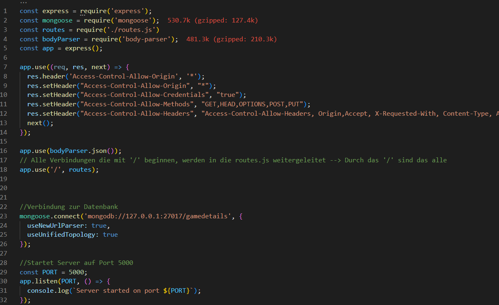

---

## User API

Diese API hat genau die gleiche Funktionalität wie die bereits beschriebene Game API, der einzige Unterschied liegt in der Art der Daten die gespeichert werden. Die Game API speicher Videospiele und die User API speicher die verschiedenen User. Deshalb wird abgesehen von dem Datenbank Modell die Funktionalität dieser API nicht näher beschrieben.

---

### MongoDB Model

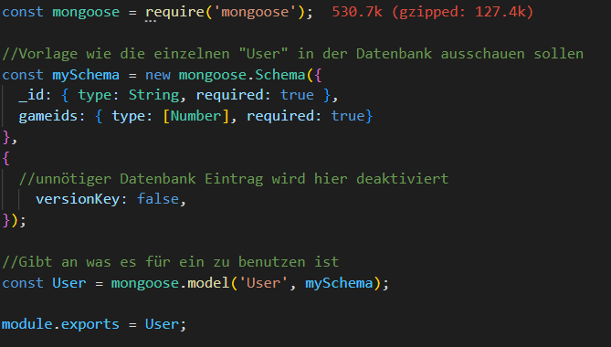

Der Unterschied zum anderen Model ist, dass es andere Daten sind die gespeichert werden. Für User wird als ID der Name des Users gespeichert da der Nutzername eindeutig ist, außerdem ein Array an SpieleIDs die direkt auf die Spiele weisen. Beim Aufruf der SpieleIDs kann direkt durch die Game API per ID auf das jeweilige Spiel zugegriffen werden.  

---

## WPF Client

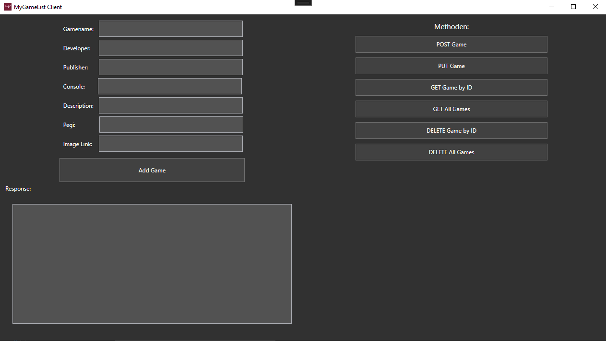

Der Client wird in diesem Projekt als Schnittstelle zur Datenbank benutzt. Mit dem Client ist es möglich alle in der API erzeugten Endpoints anzusprechen und die Datenbank damit zu füllen, zu überarbeiten, Daten zu löschen, etc. Der Client ist im Prinzip eine Alternative zu Postman die aber nur für das Projekt funktioniert.

Für jede Funktion gibt es ein eigenes Panel mit den verschiedenen Eingabemöglichkeiten, die der jeweilige Request benötigt um mit der API zu kommunizieren. Wenn die Request Art im Client von beispielsweise GetAll zu DeleteAll gewechselt wird, wird das Panel von GetAll ausgeblendet und das von DeleteAll eingeblendet.

Für den Client wird das Nuget "Newtonsoft Json" verwendet ist dementsprechend erforderlich. Der Client an sich ist in Vier Felder geteilt, wobei das Feld rechtsunten nicht benutzt wird. In der linken unteren Ecke ist Platz für das Response Feld, dieses ist immer zu sehen. Rechts oben sind Buttons um die Fenster für die jeweiligen Methoden zu wechseln. Diese bleiben auch immer stehen.

Links oben ist das Feld für die verschiedenen Methoden die durchgewechselt werden.

---

## POST Game

UI Post:

Immer wenn man den Request ändert, wird das Request Textfeld entleert. Dies hat keinen tieferen Sinn und dient ausschließlich für das Aussehen.

Am Anfang der Post Methode werden alle Daten der einzelnen Textfelder in Variablen gespeichert, welche dafür benutzt werden, um ein neues Game Objekt zu erzeugen. Mit dem Nugget Newtonsoft wird dieses Objekt dann in einen jsonstring umgewandelt, sprich das Objekt wird in JSON Format gebracht.

Damit ist es möglich diesen String per PostAsync an die gegebene API Schnittstelle zu senden und eine Response zu bekommen. Diese Response wird ausgelesen und in das Textfeld geschrieben.

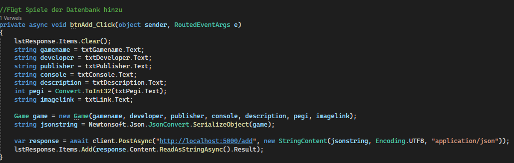

---

## Put Game

UI Put:
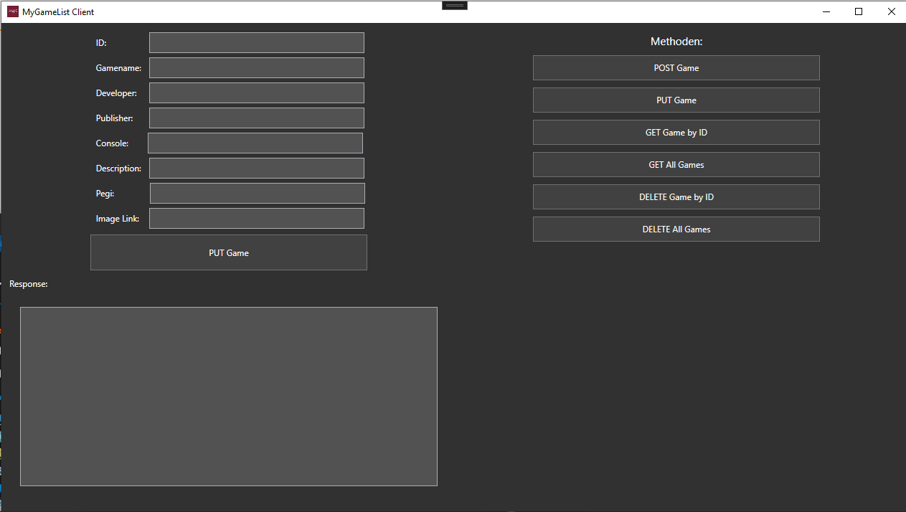

Dieses Fenster sieht dem Fenster von dem Post Request ähnlich, nur dass ein weiteres Feld hinzugefügt wurde, um die ID einzugeben.

Am Anfang der Put Methode wird überprüft, ob das Textfeld für die ID ungleich 0 ist. Diese Abfrage ist dafür da dass ich überprüfe ob eine ID eingegeben wurde, oder nicht. Falls keine eingegeben wurde, wird als Response "ID Needed" zurückgegeben. Falls eine ID eingegeben wurde, wird der ID String zu einem Integer gecastet und gespeichert. Im Anschluss wird manuell ein String im JSON Format erstellt. Es wird jedes Textfeld abgefragt, ob etwas drinnen steht und falls ja, wird die jeweilige Variable gespeichert und um entsprechenden Format zu dem JSON String hinzugefügt. 

Wenn alle Daten abgefragt wurden wird durch json.Remove() das letzte Zeichen des Strings gelöscht. Dies ist notwendig um den möglichen Beistrich zu löschen welcher durch das Zusammensetzen entsteht. Im Anschluss wird als letztes Zeichen eine schließende geschwungene Klammer gesetzt, dies ist das Ende des Strings. Dieser String wird Testweise in der Konsole ausgegeben.

Im Anschluss wird die URL gesetzt und dazu noch die Methode die benutzt werden soll, in diesem Fall PUT. Bei der URL wird am Ende die ID hinzugefügt um der API zu sagen welches Spiel geupdated werden soll. Mit new HttpRequestMessage() wird der Body für den Request gebildet. Im Anschluss wird der Content für den Request gesetzt und der Request wird abgeschickt. Der Response durch den Request wird ausgelesen und dem Response Textfeld hinzugefügt.

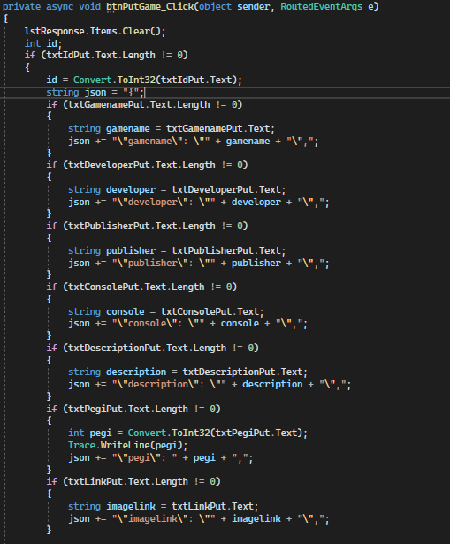
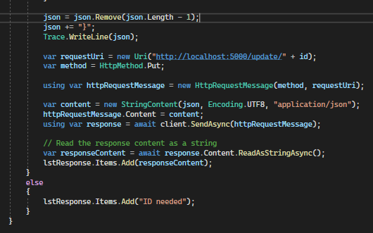

---

## Get Game by ID

UI GetGamebyID:
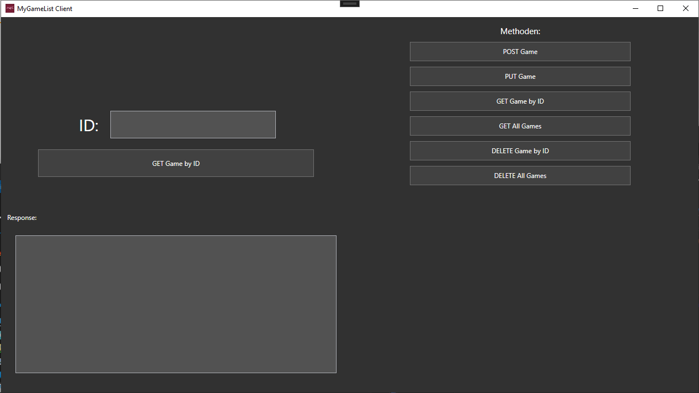

Am Anfang wird die ID in eine Variable gespeichert, welche für die URL da ist. Mit GetStringAsync() mit der jeweiligen ID wird auf die API zugegriffen und das Spiel wird zurückgegeben und in das Response Textfeld geschrieben

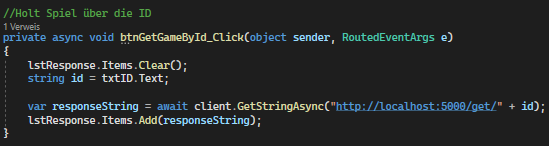

---

## Get All Games

UI Get All:
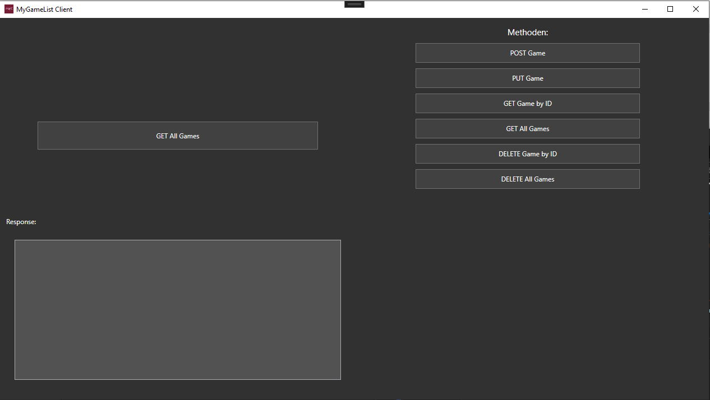

Am Anfang wird die ID in eine Variable gespeichert, welche für die URL da ist. Mit GetStringAsync() mit der jeweiligen ID wird auf die API zugegriffen und das Spiel wird zurückgegeben und in das Response Textfeld geschrieben

---

## Delete Game by ID

UI Delete by ID:

Am Anfang wird die ID in eine Variable gespeichert, welche für die URL da ist. Die URL wird direkt mit der angehängten ID gespeichert und mit DeleteAsync() mit der jeweiligen URL als Response gespeichert. Der Content des Responses wird ausgelesen und in das Response Textfeld geschrieben.

---

## Delete All Games 

UI Delete All:
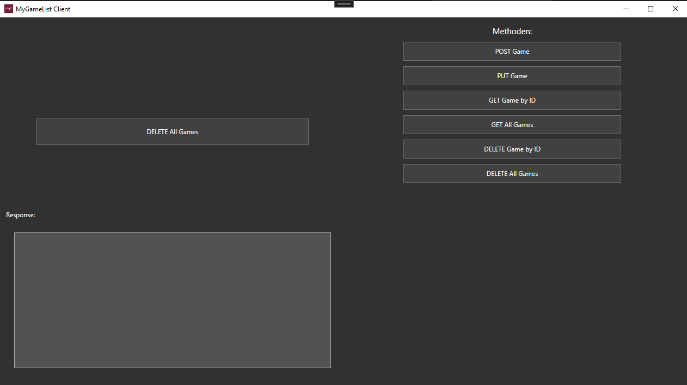

Die URL wird als String gespeichert und mit DeleteAsync() mit der jeweiligen URL als Response gespeichert. Der Content des Responses wird ausgelesen und in das Response Textfeld geschrieben.

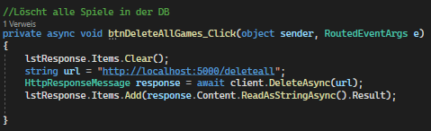

## Web Applikation
...
